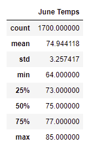
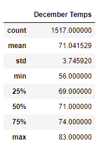
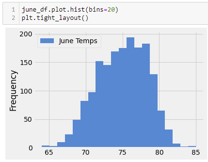
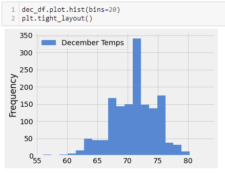
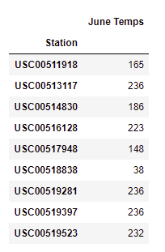
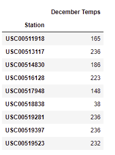
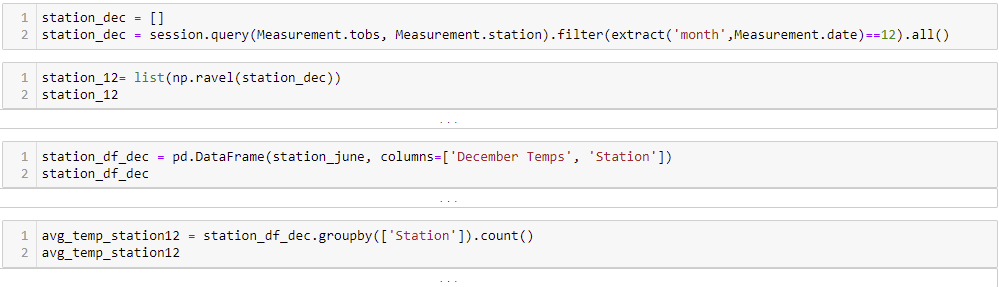

# surfs_up

### Overview of the analysis: Explain the purpose of this analysis.
-  W. Avy tasked me with querying his SQLite database that had various weather measurements from around the island of Oahu from several different weather stations.

- The purpose of our analysis today was to investigate the weather patterns of Oahu, HI for the viability of surf and ice cream shop that could possibly be open year-round. I used various techniques to query the data and deliver various statistical measurements.

- Specifically, we are looking at the months of June and December for every year between 2010 and 2017.

### Results: Provide a bulleted list with three major points from the two analysis deliverables. Use images as support where needed.
From the data that we were able to obtain, there were 3 major points to be taken from the statistical data.

* There are about 200 less measurements in December because there are not measurements for 2017. There seems to be sufficient data for the values to still be relevant.

* The first thing we notice is how similar all the stats are. For each stat there is not more than a 5-degree difference across the board. Even the average temperature is, 74.94 and 71.04 for June and December, respectively. 

 |||  

* Both data sets have low standard deviation values, indicating that they are close to the mean and thus decently stable.

### Summary: Provide a high-level summary of the results and two additional queries that you would perform to gather more weather data for June and December.
- Summary - Oahu would be an ideal location for the Surf and Ice Cream Shop that W. Avy wants to open. The stable year-round weather makes Oahu a great location. Of course, December will be slightly cooler just due to the position of the planet that time of year, but it looks like the temperature will not drop below 50 degrees.

- Additional Queries-
    1. Use histograms to see the actual distribution of the data. For the summer there is a decent spread of the temperatures from 73 to 80 during June and primarily 64 to 74 during December with 71 degrees being the majority (~350 days) of the days.
    
 ||| 
    
    2. I wrote some code to look at the data input from the stations. I wanted to see how much was coming from each station to determine if there was sufficient data coming from the station to include it in the calculation.

   

    
    
